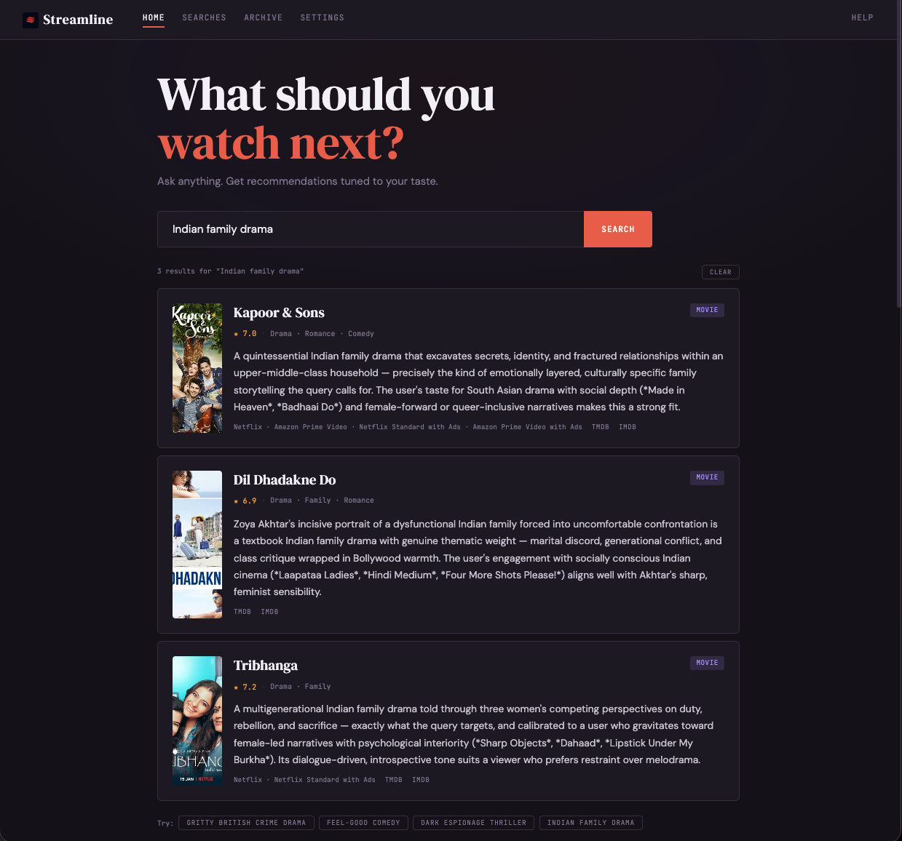

<p align="center">
  
</p>

# Streamline

A personal streaming recommendation engine that knows your actual taste — built on your real watch history from Netflix, Prime Video, and any manually tracked titles. Supports multiple LLM providers (Anthropic Claude, Google Gemini).



## How It Works

Two phases:

1. **Setup (run once)** — parses your watch history, fetches metadata from TMDB, enriches each title with a semantic description (fast model), and builds a full taste profile (reasoning model) from all enriched titles in batches.
2. **Query (any time)** — ask anything in natural language. The reasoning model parses your intent, finds candidates via TMDB Discover + semantic suggestions (hybrid generation), filters out what you've already watched, annotates streaming availability, and ranks the results against your taste profile.

## Prerequisites

- Python 3.10+
- TMDB API key (free at themoviedb.org)
- Anthropic API key and/or Google Gemini API key

## Quick Start

```bash
# 1. Create venv and install dependencies
python3 -m venv venv && source venv/bin/activate && pip install -r requirements.txt

# 2. Add your API keys to .env (gitignored)
cat > .env << 'EOF'
TMDB_API_KEY=your_key_here
ANTHROPIC_API_KEY=your_key_here
GEMINI_API_KEY=your_key_here
EOF

# 3. Add your watch history under data/ (see below)

# 4. Run offline setup
./recommend setup

# 5. Ask for recommendations
./recommend "good British crime drama"
```

## Usage

Everything goes through `./recommend`:

```bash
# Queries
./recommend "paranoid spy thriller like The Night Manager"
./recommend "give me 5 feel-good Bollywood comedies"
./recommend "why not Slow Horses?"              # explains why a title wasn't recommended

# Interactive mode (conversational — supports "more like that", refinements)
./recommend

# Setup
./recommend setup                               # first-time setup
./recommend setup --refresh-data                # re-fetch TMDB + rebuild everything
./recommend setup --refresh-profile             # rebuild taste profile only

# Feedback
./recommend --liked "Tinker Tailor Soldier Spy"
./recommend --disliked "The Long Season"
./recommend --add "Shetland" --type tv

# Options
./recommend --debug "spy thriller"              # full pipeline trace
./recommend -n 5 "dark thriller"                # override result count
./recommend --provider gemini "spy thriller"     # use Gemini instead of default
```

Each query prints token usage and estimated cost at the end.

## Web UI

```bash
./recommend-web start                           # http://localhost:5050
./recommend-web stop
./recommend-web status
./recommend-web restart
./recommend-web logs
```

The web UI provides a search interface, taste profile dashboard with expandable clusters, and a watch history archive with list/grid/compact views.


Port and host are configurable via `STREAMLINE_PORT` and `STREAMLINE_HOST` environment variables.

## Configuration

Settings live in two places:

- **`.env`** — secrets only (API keys, gitignored)
- **`config.yaml`** — everything else (models, tunables, data paths)

### LLM Providers

```yaml
# config.yaml
provider: anthropic                    # or "gemini"

models:
  anthropic:
    fast: claude-haiku-4-5-20251001    # enrichment (high volume, cheap)
    reason: claude-sonnet-4-6          # intent, ranking, profile (complex reasoning)
  gemini:
    fast: gemini-2.5-flash
    reason: gemini-2.5-pro
```

Switch providers by changing `provider:` in config.yaml or per-query with `--provider gemini`. Model names are user-configurable — update them when new models are released.

### Title Overrides

When TMDB can't match a title, create `data/overrides.json`:

```json
{
  "The Matrix III Revolutions": {"title": "The Matrix Revolutions"},
  "21 REPACK": {"title": "21"},
  "Some Cooking Show Episode": {"skip": true},
  "Delhi Cops Episode": {"title": "Delhi Cops", "content_type": "tv"}
}
```

The override file is auto-detected — run `./recommend setup` (no flags needed) and it triggers a rebuild.

### Settings Reference

All settings in `config.yaml`. The file is well-commented — see it for full details.

**LLM:**
| Setting | Default | Description |
|---------|---------|-------------|
| `provider` | anthropic | LLM provider ("anthropic" or "gemini") |
| `models.*` | (see above) | Model assignments per provider (fast/reason roles) |
| `llm.timeout_*` | 30-300s | Per-call-type timeouts |
| `llm.tokens_*` | 200-4000 | Per-call-type max output tokens |
| `llm.profile_batch_size` | 200 | Titles per taste profile batch |
| `llm.rate_limit_wait` | 65 | Seconds to wait on rate limit |

**Scoring:**
| Setting | Default | Description |
|---------|---------|-------------|
| `scoring.weight_completion` | 0.5 | Weight for watch completion rate |
| `scoring.weight_rewatch` | 0.3 | Weight for rewatch bonus |
| `scoring.weight_recency` | 0.2 | Weight for recency (must sum to 1.0) |
| `scoring.default_tv_runtime` | 45 | Fallback TV episode runtime (minutes) |
| `scoring.default_movie_runtime` | 90 | Fallback movie runtime (minutes) |
| `scoring.rewatch_saturation` | 5 | Log scale saturates at ~N rewatches |

**Manual titles:**
| Setting | Default | Description |
|---------|---------|-------------|
| `manual.timestamp` | now | "now" (competitive) or "2022-01-01" (lower scoring) |
| `manual.tv_duration_minutes` | 45 | Synthetic watch duration for TV |
| `manual.movie_duration_minutes` | 120 | Synthetic watch duration for movies |

**Recommendations:**
| Setting | Default | Description |
|---------|---------|-------------|
| `default_top_n` | 3 | Default results per query |
| `min_vote_count` | 20 | Minimum TMDB votes for discover candidates |
| `recency_half_life_days` | 90 | Days until recency score halves |
| `watch_region` | US | Region for streaming availability lookup |
| `streaming_platforms` | [] | Your subscribed platforms (filters results when set) |

## Watch History Sources

Place exported CSV files under `data/`:

| Platform | Path |
|----------|------|
| Netflix | `data/netflix/<account_id>/CONTENT_INTERACTION/ViewingActivity.csv` |
| Prime Video | `data/prime_video/Your Prime Video Viewing Activity/Viewing History.csv` |
| Manual list | `data/manual/tv.csv` and `data/manual/movies.csv` |

Netflix and Prime exports are available from their account settings pages. Manual files are plain text, one title per line. Movie titles may include a trailing year (`Zodiac 2007`) which is stripped automatically.

## Running Tests

```bash
python3 -m pytest tests/ -v
```
