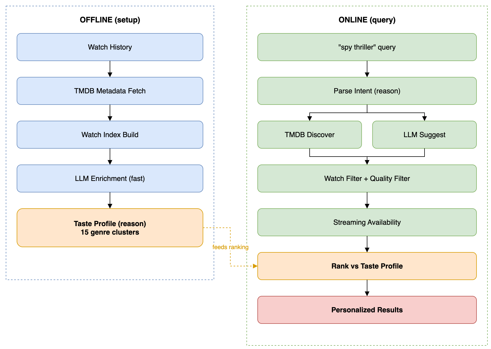

<p align="center">
  
</p>

<h1 align="center">Streamline</h1>

<p align="center">
  <strong>A personal streaming recommendation engine that knows your actual taste.</strong>
</p>

<p align="center">
  <a href="#features">Features</a> &bull;
  <a href="#how-it-works">How It Works</a> &bull;
  <a href="#quick-start">Quick Start</a> &bull;
  <a href="#web-ui">Web UI</a> &bull;
  <a href="#configuration">Configuration</a>
</p>

<p align="center">
  
  
  
  
</p>

---

Streamline ingests your real watch history from Netflix, Prime Video, Apple TV, and manual lists, enriches every title via TMDB and LLM, builds a detailed taste profile from *all* your watched content, then answers natural-language queries using hybrid candidate generation. No generic "top 10" lists — recommendations are calibrated to *your* patterns.

<p align="center">
  
</p>

## Features

- **Natural language search** — "paranoid spy thriller like The Night Manager", "feel-good Bollywood comedy", "why not Slow Horses?"
- **Mood Match wizard** — a guided alternative to free-text search: an instant content-type tap, then a short adaptive question loop grounded in your taste profile that narrows tone, pace, and intensity before recommending. Refine results in place ("shorter", "lighter", "surprise me") without restarting.
- **Taste profile** — built from your entire watch history (2000+ titles), organized into 15+ genre clusters with deep analysis
- **Hybrid candidate generation** — TMDB Discover (structured filters) + LLM semantic suggestions (creative matches)
- **Multi-provider LLM** — Anthropic (Claude), Google (Gemini), OpenAI, and any local/self-hosted OpenAI-compatible endpoint (e.g. Ollama) with role-based model dispatch (fast/reason)
- **Web UI** — Flask + HTMX with editorial design: search, taste profile dashboard, poster archive, watchlist management, search history, settings
- **Rich CLI** — interactive REPL, conversational context ("more like that"), feedback system, usage/cost tracking
- **Streaming availability** — annotated results with platform filtering (Netflix, Prime, etc.)
- **Quality filters** — configurable minimum rating, release year, and vote count
- **Title intelligence** — guessit classification, rapidfuzz dedup, manual overrides, IMDB/TMDB links
- **Fully configurable** — shared settings in `config.yaml`, local watch-history overrides in `config.local.yaml`

## How It Works

<p align="center">
  
</p>

1. **Setup (run once)** — parses your watch history, fetches metadata from TMDB, enriches each title with a semantic description (fast model), and builds a full taste profile (reasoning model) from all enriched titles in batches.
2. **Query (any time)** — ask anything in natural language. The reasoning model parses your intent, finds candidates via TMDB Discover + semantic suggestions, filters out what you've already watched, annotates streaming availability, and ranks results against your taste profile.

## Quick Start

```bash
# 1. Clone and setup
git clone https://github.com/abhichandra21/streamline.git
cd streamline
python3 -m venv .venv && source .venv/bin/activate && pip install -r requirements.txt

# 2. Set your API keys in the environment (.env is optional local convenience)
cat > .env << 'EOF'
TMDB_API_KEY=your_key_here
ANTHROPIC_API_KEY=your_key_here
GEMINI_API_KEY=your_key_here          # optional
EOF

# 3. Copy config.local.example.yaml to config.local.yaml and set provider zip paths

# 4. Run offline setup
./recommend setup

# 5. Ask for recommendations
./recommend "good British crime drama"
```

## Usage

Everything goes through `./recommend`:

```bash
# Queries
./recommend "paranoid spy thriller like The Night Manager"
./recommend "give me 5 feel-good Bollywood comedies"
./recommend "why not Slow Horses?"              # explains why a title wasn't recommended
./recommend "I started Severance and stopped. Should I keep going?"

# Interactive mode (supports "what else?", "more like #2", and follow-up refinements)
./recommend

# Setup
./recommend setup                               # first-time setup
./recommend setup --refresh-data                # re-fetch TMDB + rebuild everything
./recommend setup --refresh-profile             # rebuild taste profile only

# Feedback
./recommend --liked "Tinker Tailor Soldier Spy"
./recommend --disliked "The Long Season"
./recommend --add "Shetland" --type tv
./recommend --history                           # show recent query history

# Options
./recommend --debug "spy thriller"              # full pipeline trace
./recommend -n 5 "dark thriller"                # override result count
./recommend --provider gemini "spy thriller"     # use Gemini, OpenAI, or a local model instead of default
```

The built-in Help page is the canonical query guide. After starting the web UI, see `/help#query-guide` for supported recommendation queries, abandoned-watch queries, conversational refinements, and command-style inputs.

Each query prints token usage and estimated cost at the end.

Bash and zsh completions for `./recommend` and `./recommend-web` are in `completions/`:

```bash
source completions/recommend.bash    # bash
source completions/_recommend.zsh    # zsh
```

## Web UI

```bash
./recommend-web start                           # http://localhost:5051
./recommend-web stop
./recommend-web status
./recommend-web restart
./recommend-web logs
```

The web UI includes:
- **Home** — natural language search with HTMX, suggestion pills, recent searches
- **Mood Match** — guided wizard (`/wizard`): content-type tap, adaptive taste-grounded questions, review step, and in-place result refinement
- **Searches** — expandable history of past queries with cached results and watchlist actions
- **Archive** — full watch history with poster grid, list, and compact views; sortable A-Z/Z-A
- **Watchlist** — save/unsave titles from any page, CSV export
- **Settings** — edit all configuration from the browser with live reload
- **Help** — built-in usage guide
- **Logs & status** — `/logs` tails the app log from the browser; `/status` and `/healthz` report provider, cache, and last-run state for monitoring

Port and host are configurable via `STREAMLINE_PORT` and `STREAMLINE_HOST` environment variables.

### Running as a service

For an always-on deployment (e.g. a homeserver), run behind gunicorn via the provided systemd unit instead of `./recommend-web start`:

```bash
sudo cp streamline-web.service /etc/systemd/system/
sudo systemctl enable --now streamline-web
```

Edit the `User`, `WorkingDirectory`, and venv paths in `streamline-web.service` to match your install first.

## Configuration

Settings live in a few places:

- **Environment variables** — secrets only (`TMDB_API_KEY`, `ANTHROPIC_API_KEY`, `GEMINI_API_KEY`, `OPENAI_API_KEY`)
- **`.env`** — optional local convenience for setting those environment variables (gitignored)
- **`config.yaml`** — shared repo defaults and app settings
- **`config.local.yaml`** — local overrides such as watch-history zip paths, loaded after `config.yaml`

### LLM Providers

```yaml
# config.yaml
provider: anthropic                    # or "gemini", "openai", or "local"

models:
  anthropic:
    fast: claude-haiku-4-5-20251001    # enrichment (high volume, cheap)
    reason: claude-sonnet-4-6          # intent, ranking, profile (complex reasoning)
  gemini:
    fast: gemini-2.5-flash
    reason: gemini-2.5-pro
  openai:
    fast: gpt-4.1-mini
    reason: gpt-4.1
  local:
    fast: gpt-oss:120b                 # any OpenAI-compatible endpoint (e.g. Ollama)
    reason: gpt-oss:120b
    base_url: http://localhost:11434/v1
    timeout_scale: 5                   # local inference is slower; scales llm.timeout_*
```

Switch providers by changing `provider:` in config or per-query with `--provider gemini`.

By default, each provider reads its API key from the standard environment variable name:

- Anthropic: `ANTHROPIC_API_KEY`
- Gemini: `GEMINI_API_KEY`
- OpenAI / compatible: `OPENAI_API_KEY`
- Local: uses the `openai` client against `models.local.base_url`; no key needed for most self-hosted servers

Only add `models.<provider>.api_key_env` in config when you need a non-standard variable name.

### Quality Filters

```yaml
min_rating: 6.5      # minimum TMDB rating (0 to disable)
min_year: 2000        # minimum release year (0 to disable)
min_vote_count: 20    # filter obscure titles
```

### Title Overrides

When TMDB can't match a title, create `data/overrides.json`:

```json
{
  "The Matrix III Revolutions": {"title": "The Matrix Revolutions"},
  "21 REPACK": {"title": "21"},
  "Some Cooking Show Episode": {"skip": true},
  "Delhi Cops Episode": {"title": "Delhi Cops", "content_type": "tv"}
}
```

<details>
<summary><strong>Full Settings Reference</strong></summary>

All shared settings in `config.yaml`:

**LLM:**
| Setting | Default | Description |
|---------|---------|-------------|
| `provider` | anthropic | LLM provider ("anthropic", "gemini", "openai", or "local") |
| `models.*` | (see above) | Model assignments per provider (fast/reason roles) |
| `llm.timeout_*` | 30-300s | Per-call-type timeouts |
| `llm.tokens_*` | 200-16000 | Per-call-type max output tokens |
| `llm.profile_batch_size` | 200 | Titles per taste profile batch |
| `llm.rate_limit_wait` | 65 | Seconds to wait on rate limit |

**Mood Match wizard:**
| Setting | Default | Description |
|---------|---------|-------------|
| `wizard.max_questions` | 5 | Hard cap on questions before the wizard must recommend |
| `wizard.min_questions` | 4 | Soft floor (incl. the content-type tap) before it may finish on its own; bounded by `max_questions` |
| `wizard.max_tokens` | 1200 | Output-token ceiling per wizard turn (the finalize turn emits a full intent) |

**Scoring:**
| Setting | Default | Description |
|---------|---------|-------------|
| `scoring.weight_completion` | 0.5 | Weight for watch completion rate |
| `scoring.weight_rewatch` | 0.3 | Weight for rewatch bonus |
| `scoring.weight_recency` | 0.2 | Weight for recency (must sum to 1.0) |
| `scoring.default_tv_runtime` | 45 | Fallback TV episode runtime (minutes) |
| `scoring.default_movie_runtime` | 90 | Fallback movie runtime (minutes) |

**Recommendations:**
| Setting | Default | Description |
|---------|---------|-------------|
| `default_top_n` | 3 | Default results per query |
| `min_vote_count` | 20 | Minimum TMDB votes for discover candidates |
| `min_rating` | 6.5 | Minimum TMDB rating (0 to disable) |
| `min_year` | 2000 | Minimum release year (0 to disable) |
| `recency_half_life_days` | 90 | Days until recency score halves |
| `watch_region` | US | Region for streaming availability |
| `streaming_platforms` | [] | Your subscribed platforms |

</details>

## Watch History Sources

Keep shared settings in `config.yaml` and machine-specific watch-history paths in
`config.local.yaml`. Start by copying `config.local.example.yaml`.

**Why exports instead of direct API calls?** Netflix shut down its public API in 2014. Prime Video and Apple TV have never offered one. Unofficial scraping approaches exist but violate each platform's Terms of Service and break routinely as page structures change. The GDPR data export route (right to data portability) is the only approach that is legitimate, stable, and platform-sanctioned — and the export files contain your complete, unfiltered watch history, which a public API would never expose anyway.

| Platform | Path | How to export |
|----------|------|---------------|
| Netflix | `platform_paths.netflix: data/netflix/<export>.zip` | Account Settings > Download your data |
| Prime Video | `platform_paths.prime: data/prime_video/Prime Video.zip` | Account > Digital content > Request your data |
| Apple TV | `platform_paths.apple_tv: data/AppleTV/Apple Media Services Information Part 1 of 2.zip` | Apple privacy export |
| Manual | `data/manual/tv.csv` / `movies.csv` | One title per line |

`config.local.yaml` is gitignored and loaded after `config.yaml`, so local provider paths stay out of the shared repo config.

Movie titles may include a trailing year (`Zodiac 2007`) which is stripped automatically.

## Architecture

Two-phase LLM pipeline with role-based model dispatch:

| Module | Purpose |
|--------|---------|
| `recommender/llm.py` | Provider abstraction (Anthropic/Gemini/OpenAI/local), token tracking, rate limit retry |
| `recommender/query_engine.py` | Online pipeline: intent parsing, hybrid candidates, ranking |
| `recommender/wizard.py` / `wizard_flow.py` | Mood Match: deterministic content-type tap + LLM-led adaptive question loop, synthesizes a `QueryIntent` |
| `recommender/taste_profile_builder.py` | Batched profile build with cache, truncation detection |
| `recommender/tmdb_client.py` | TMDB metadata, discover endpoint, streaming providers |
| `recommender/enricher.py` | LLM enrichment with caching |
| `recommender/signals.py` | Engagement scoring (completion, rewatch, recency) |
| `recommender/web.py` | Flask + HTMX web UI |
| `recommender/main.py` | Rich CLI |

See [`docs/architecture.md`](docs/architecture.md) for the full design document.

## Running Tests

```bash
python3 -m pytest tests/ -v
```

## Utility Scripts

- `tools/compare_providers.py` — runs a fixed query set against two LLM providers (e.g. `anthropic` vs `local`) and writes a side-by-side comparison
- `tools/merge_user_state.py` — merges watchlist/ratings/history between two copies of the same install (e.g. local machine and a homeserver deployment) without overwriting either side

## Contributing

Contributions are welcome! Please open an issue first to discuss what you'd like to change. See [`docs/roadmap.md`](docs/roadmap.md) for planned work.

## License

[MIT](LICENSE)
