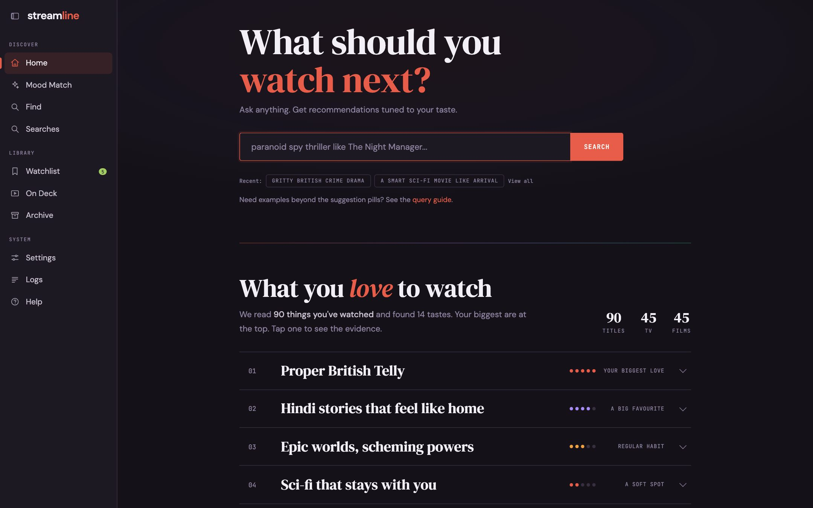
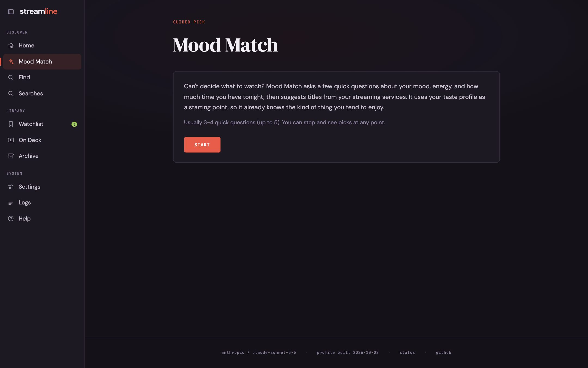
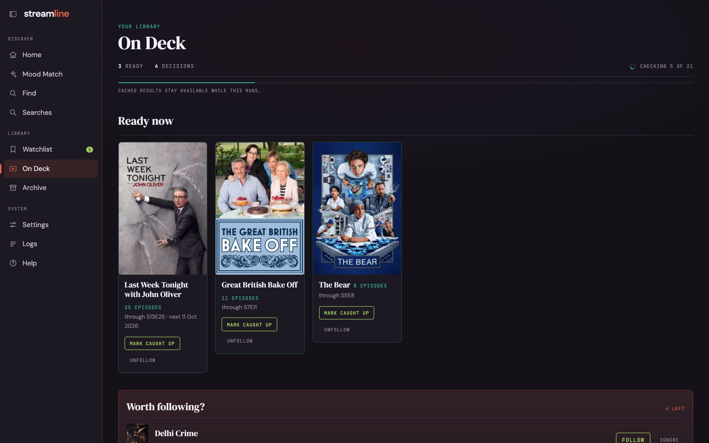
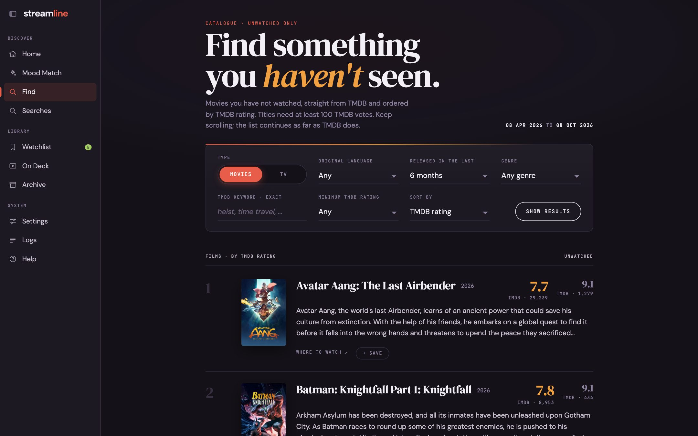
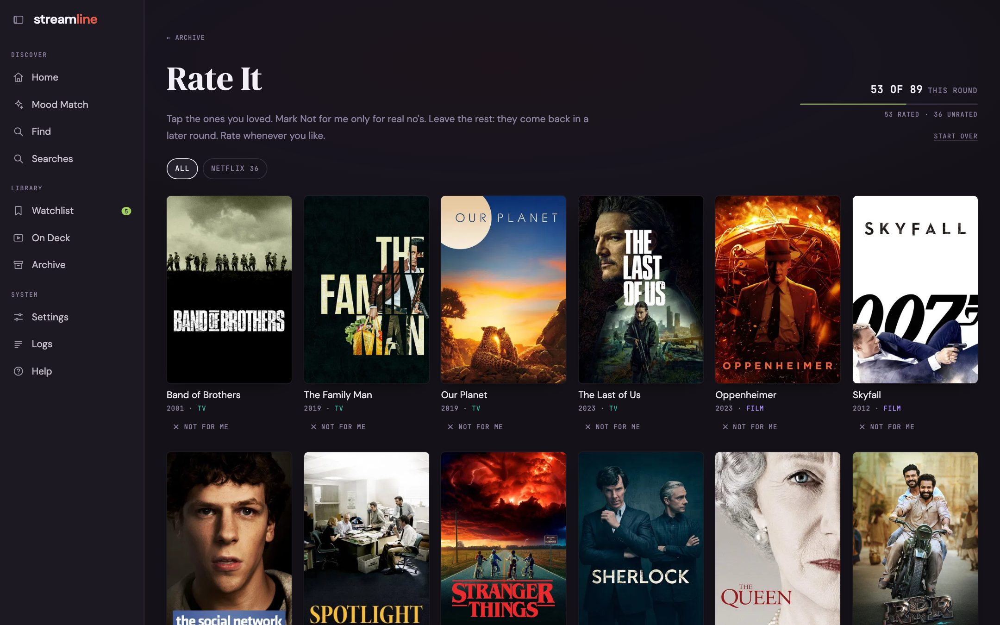
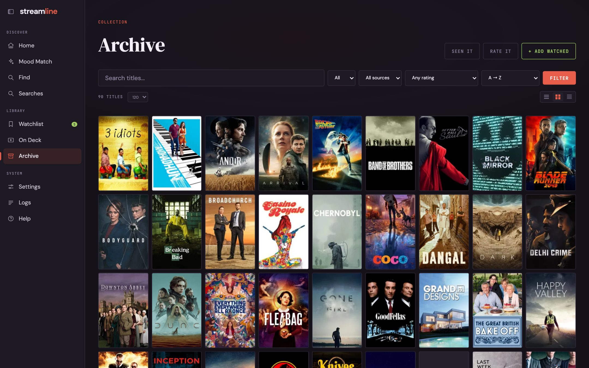

<p align="center">
  
</p>

<h1 align="center">Streamline</h1>

<p align="center">
  <strong>Stop scrolling. Start watching.</strong><br>
  A self-hosted recommendation engine that learns your taste from everything you've actually watched,<br>
  then answers "what should I watch tonight?" like a friend who has seen it all.
</p>

<p align="center">
  <a href="https://streamline-docs.pages.dev"><strong>Documentation</strong></a> &bull;
  <a href="#quick-start">Quick start</a> &bull;
  <a href="#a-look-around">Screenshots</a>
</p>

<p align="center">
  
  
  
  
</p>

<p align="center">
  
</p>

---

Every streaming app recommends from its own catalogue, to keep you on its own service.
None of them know you also watched three seasons of a British cop show somewhere else, or that you gave up on the drama everyone loved.

**Streamline does.**
It reads your real history from Netflix, Prime Video, Apple TV, Disney+, Max, and Plex, learns what you love, and recommends across every service, with a reason for every pick.

> **You:** gritty British crime drama
>
> **Streamline:** **Unforgotten** · IMDb 8.4 · Prime Video
> *A methodical, understated British police drama set on grey London streets, with the patient slow-burn tension, emotional depth, and layered cold-case mysteries this user loves from Broadchurch.*

## Why it's different

- **It knows your history, from every service.** Not one app's view of you, but all of it in one place.
- **It learns from what you loved, not just what you finished.** Tap through your history in Rate It, and your taste becomes named rows like *Proper British Telly* or *Sci-fi that stays with you*.
- **It doesn't recommend what you've already seen,** whichever service you saw it on.
- **It explains itself.** Every pick says why it fits *you*. Ask "why not Slow Horses?" and it tells you exactly why it was left out.
- **It's yours.** It runs on your laptop or home server, your history lives in one SQLite file, and you choose the AI: Claude, Gemini, OpenAI, or a local model.
- **It's cheap to run.** With the default Claude models, about $1 to describe 1,000 titles once, a few dollars to build a large taste profile, and roughly 6 cents a search. Find, On Deck, and the rest of the app cost nothing. [Details](https://streamline-docs.pages.dev/getting-started/#what-it-costs)

## A look around

<table>
  <tr>
    <td width="50%"><br><strong>Ask anything.</strong> Plain English in, explained picks out, with where to stream them.</td>
    <td width="50%"><br><strong>Mood Match.</strong> Can't decide? A few quick questions about tonight, then picks.</td>
  </tr>
  <tr>
    <td><br><strong>On Deck.</strong> Every show you follow, and which ones have new episodes ready.</td>
    <td><br><strong>Find.</strong> The best-rated titles you haven't seen, filtered your way. Instant, no AI.</td>
  </tr>
  <tr>
    <td><br><strong>Rate It.</strong> Tap the posters you loved. That's how it learns.</td>
    <td><br><strong>Archive.</strong> Everything you've ever watched, from every service, in one wall of posters.</td>
  </tr>
</table>

<sub>Screenshots come from a demo library of famous titles, not anyone's real history.</sub>

## Also

- **Watchlist** across every service, with CSV export
- **Plex** plays and ratings arrive as they happen
- **IMDb ratings** on search results, with TMDB as the fallback
- **Home Assistant** sensors and a calendar of upcoming episodes
- **Docker images** for x86 and ARM, Raspberry Pi included
- **A full command line**, with an interactive mode that remembers the conversation ("more like #2", "but lighter")

## Quick start

With Docker:

```bash
git clone https://github.com/abhichandra21/streamline.git && cd streamline
mkdir -p data recommender/cache logs
cp config.local.example.yaml config.local.yaml      # then point it at your exports in data/
printf 'TMDB_API_KEY=...\nANTHROPIC_API_KEY=...\n' > .env

docker compose run --rm streamline ./recommend setup
docker compose up -d                                # open http://localhost:5051
```

Or with Python 3.10+:

```bash
git clone https://github.com/abhichandra21/streamline.git && cd streamline
python3 -m venv .venv && source .venv/bin/activate && pip install -r requirements.txt
cp config.local.example.yaml config.local.yaml      # then point it at your exports
printf 'TMDB_API_KEY=...\nANTHROPIC_API_KEY=...\n' > .env

./recommend setup
./recommend-web start                               # open http://localhost:5051
```

The [Getting started guide](https://streamline-docs.pages.dev/getting-started/) walks through every step, including where to download each service's history.

## How it works

**Once:** Streamline matches every title you've watched on TMDB and writes a short description of each.
From the titles you mark Loved, it builds a taste profile of named themes.

**Every search:** an LLM turns your words into a structured request.
Candidates come from TMDB and from the model's own suggestions, anything you've seen is removed, and the rest is checked for where it streams and ranked against what you asked for and what you love.

The [architecture page](https://streamline-docs.pages.dev/reference/architecture/) has the full picture.

## Documentation

Everything else is on the docs site, **[streamline-docs.pages.dev](https://streamline-docs.pages.dev)**:

- [Getting started](https://streamline-docs.pages.dev/getting-started/)
- [Using each page](https://streamline-docs.pages.dev/guides/search/)
- [Docker](https://streamline-docs.pages.dev/guides/docker/), [watch history exports](https://streamline-docs.pages.dev/guides/watch-history/), [Plex](https://streamline-docs.pages.dev/guides/plex/), [Home Assistant](https://streamline-docs.pages.dev/guides/home-assistant/)
- [Command line](https://streamline-docs.pages.dev/reference/cli/) and [configuration](https://streamline-docs.pages.dev/reference/configuration/)

## Contributing

Issues and pull requests are welcome; please open an issue first for larger changes.
Run the tests with `python3 -m pytest tests/`, and see the [roadmap](https://streamline-docs.pages.dev/reference/roadmap/) for what's planned.

## License

[MIT](LICENSE)
