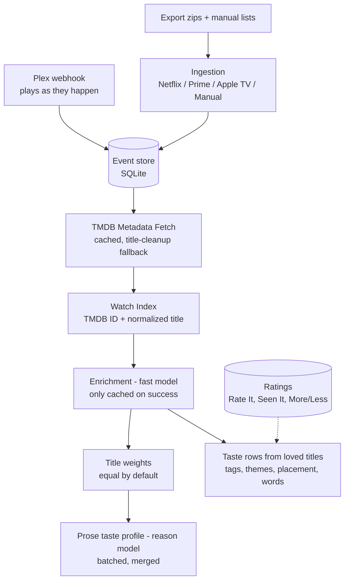
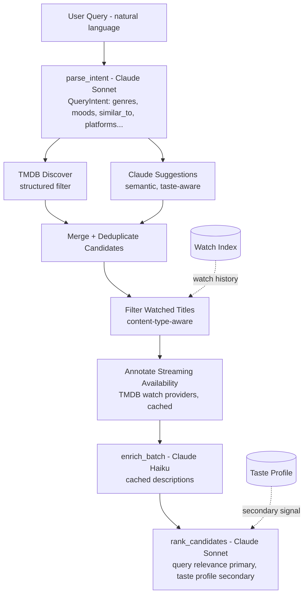

# Architecture

## Overview

Two-phase LLM pipeline. The offline phase runs once (or on demand) to build persistent artifacts. The online phase runs on every query.

### Offline (setup)



### Online (query)



## Components

### Ingestion (`recommender/ingestion/`)

| Module | Source | Key fields |
|--------|--------|------------|
| `netflix.py` | raw Netflix export zip with `ViewingActivity.csv` inside | title, duration, timestamp, profile |
| `prime.py` | raw Prime Video export zip with `Viewing History.csv` inside | title, duration, timestamp |
| `apple_tv.py` | raw Apple privacy export zip with `Video Play Activity.csv` inside | title, duration, timestamp, storefront |
| `manual.py` | `data/manual/tv.csv` + `movies.csv` | title only; synthetic duration + current timestamp |

All parsers emit `WatchEvent` dataclasses (defined in `base.py`). Manual entries use `datetime.now()` as timestamp so they score competitively with platform data. Each file type deduplicates independently (TV and movie lists use separate seen sets).

`base.py` also provides a shared `is_bonus_content()` filter, wired into all four parsers, that drops clips/trailers/featurettes/sing-alongs/deleted-scene rows before they ever reach TMDB matching.

### Signals (`recommender/signals.py`)

By default (`scoring.use_viewing_signals: false`) every watched title gets the same weight, 1.0, however many times or for how long it was watched.
More like this and Less like this ratings still raise or lower a title.
Tied titles sort by their most recent real watch date.

With `use_viewing_signals: true`, it computes a score per unique title from raw watch events:

- **Completion ratio** (50%) — `watched_duration / runtime` (uses TMDB runtime when available, falls back to 45min TV / 90min movie)
- **Rewatch bonus** (30%) — log-scale multiplier for titles watched more than once
- **Recency decay** (20%) — true half-life decay: `0.5 ^ (days / half_life_days)`

### TMDB Client (`recommender/tmdb_client.py`)

Four roles:

1. **Metadata lookup** (`get_metadata`) — text search by title + content type, returns `TmdbMetadata`. On miss, tries cleaned title variants (strips parenthetical suffixes, edition markers, episode prefixes, season markers) and falls back to alternate content type. A post-search validator rejects a top-scoring candidate that isn't plausibly related to the source title (title-similarity check, boosted by an original-language bonus) rather than trusting vote/popularity weight alone — this stops generic/short titles like "Don" from matching an unrelated, more popular result. Distinguishes an outright API/search failure from a genuine zero-results response. Cached at `recommender/cache/tmdb/`.

2. **Candidate discovery** (`search_by_filters`) — calls TMDB Discover endpoint with genre IDs, origin countries, languages, and year range. Page-limited to `MAX_DISCOVER_PAGES` (20). Failed fetches are logged, not silently swallowed.

3. **Disambiguation candidates** (`get_disambiguation_candidates`) — cross-type ranked candidate search (checks both the hinted content type and the alternate one) used when a manually-added title can't be resolved to a single confident match. Backs the manual-add disambiguation modal (see below).

4. **Watch providers** (`get_watch_providers`) — looks up flatrate streaming availability by region. Cached at `recommender/cache/providers/`.

Genre name -> TMDB ID mappings are stored as module-level dicts. TV has no "thriller" genre, so for TV it is left out of the Discover genre filter instead of mapping to Mystery.

### Watch Index (`recommender/watch_index.py`)

Persisted at `recommender/cache/watch_index.json`.

Content-type-aware dual-key lookup:
- **Primary key** — TMDB ID
- **Fallback key** — `(normalized_title, content_type)` tuple

This prevents cross-media false matches (watching the TV show "Fargo" won't block the movie "Fargo" from recommendations).

Each entry also aggregates provenance across all its watch events: `platforms` (sorted source list, merged on dedup) and `last_watched` (latest ISO timestamp). This backs the `/history` source-provider filter and "Recently watched" sort; manual additions carry their own `manual` source.

### Enricher (`recommender/enricher.py`)

Calls Claude Haiku to generate 2-3 sentence semantic descriptions per title. Only successful LLM responses are cached — fallback descriptions (keyword strings) are not persisted, allowing retry on subsequent runs.

The enrichment index (`index.json`) uses identity keys: `content_type/tmdb_id` for resolved titles (e.g. `tv/12345`) and `unknown/slug` for unresolved ones. A `_title_keyed_enrichments()` bridge in `setup.py` converts identity keys back to display titles for the taste profile builder.

### Taste Profile Builder (`recommender/taste_profile_builder.py`)

Processes ALL enriched titles (no limit) in batches of 200. Each batch produces a mini taste profile, then a merge pass consolidates them into one document covering every taste cluster. Includes rate limit retry with backoff.

Previous profiles are auto-backed up with timestamps before rebuild.

Less like this ratings are included in the prompt, generating a "What you don't enjoy" section.

The profile is rebuilt only on request: `setup --refresh-profile`, `setup --rethink-themes`, or a first install with no profile.
A routine `setup --refresh-data` refreshes data only and makes no taste-profile LLM calls.

### Taste Rows (`recommender/taste_tags.py`, `taste_themes.py`, `taste_rows.py`)

The home page's "What you love to watch" rows, and the structured profile that search and Mood Match read, come from titles marked Loved (in Rate It, or by following a show), not from everything watched.
The AI makes each judgement once per title, and code does the rest, so the same ratings give the same rows in the same order.

1. **Tags** — each loved title gets 5-8 specific taste tags from its enrichment, written once by the reasoning model and saved in `taste_tags.json`.
2. **Themes** — one reasoning call maps tags to 10-16 themes, saved in `taste_themes.json`. New tags are filed into existing themes; themes are rethought only with `setup --rethink-themes`.
3. **Placement** — code puts each title in the theme with the strongest tag vote. Unclear cases are placed once by the AI and saved in `taste_placements.json`. Region rows (British, Hindi) also require TMDB to agree on origin.
4. **Words** — row names and descriptions are saved in `taste_words.json` and rewritten only when a row's members change by more than 20%.

An unchanged rebuild makes no LLM calls and writes an identical profile.

The merged output is capped at 15 clusters. Family/kids/seasonal clusters (Disney, Pixar, Christmas, holiday, children's content, etc.) are sorted after personal-taste clusters so a cap never silently drops a genre the user actually cares about in favor of shared/family viewing. Markdown section headings are renumbered sequentially after merging so a dropped or reordered cluster doesn't leave gaps.

### User Store (`recommender/user_store.py`)

SQLite storage (`data/streamline.db`) for user-managed state:

- **Watchlist** (`saved_titles` with status `watchlist`) — save/unsave from any UI page, CSV export
- **Dismissed** (`saved_titles` with status `dismissed`) — excluded from recommendations
- **Ratings** (`title_ratings`) — More like this (Loved), It was fine, Less like this (Not for me). Used as weights in the profile rebuild, and sent fresh into every search (see Query Engine)
- **Manual archive** (`manual_archive_entries`) — titles added via CLI or web UI, and Seen It marks
- Less like this titles inform negative preference prompting in the taste profile

All lookups use TMDB-ID-first matching with normalized-title fallback. `UserStateIndex` (in `user_state.py`) provides a read-only snapshot for fast matching in query filtering and UI rendering.

`find_conflict(content_type, tmdb_id)` checks the watchlist and manual archive for an existing record of a title, used by the manual-add disambiguation flow to warn before a duplicate add. `mark_watched_from_watchlist()` promotes a watchlist entry straight to the archive.

Note: `recommender/feedback.py` is deprecated. The original JSON-based feedback was migrated to the SQLite tables above.

### Query History (`recommender/history.py`)

The same SQLite database holds query history in a `query_history` table: one row per search, with the whole entry stored as JSON so optional and future metadata (Mood Match source, label, summary, intent) round-trips untouched. The module keeps its long-standing interface — `record()`, `load(limit)` newest-first, `delete(timestamp)` — and the 100-entry cap, now enforced in the same transaction as the write. Concurrent CLI and web access relies on SQLite transactions instead of file locking.

A pre-SQLite `query_history.json` is imported once on first use, inside one transaction, guarded by a marker in `query_history_meta` so a restored backup cannot be imported twice. First use writes that marker even when there is no legacy file, so a JSON that turns up later — a restored backup, a copy from another machine — is treated as a backup rather than a source and left untouched; importing it on purpose means deleting the marker row first. The CLI and web UI can reach a fresh store simultaneously, so the marker is re-read under a `BEGIN IMMEDIATE` write lock: whoever takes the lock imports, the others see the marker and leave. After a successful import the file is renamed to `query_history.json.migrated` and kept. A malformed file raises `history.MigrationFailed` before the store is opened, so neither the file nor the database changes — not even an empty table, and on a fresh install no database file at all. The web layer's three `record()` call sites treat any failure as non-fatal and log it, so a busy database never costs you a finished recommendation; `/searches` still surfaces a failed import.

Because history creates the event database file for its own tables, `event_store.load_events()` returns `[]` when `watch_events` is absent, and the export fallbacks in `main.py` and `web.py` test `event_store.has_event_store()` rather than the file's existence. Installs that read provider exports directly keep working after history is opened, and an initialized store stays authoritative even when it holds no events — setup records zero-event imports, so an empty event store is an answer, not a missing one.

### Manual-Add Disambiguation (`/archive/resolve`, `/archive/confirm` in `web.py`)

Manually adding a title from the web UI can be ambiguous (multiple TMDB matches, wrong content type, or a title the user already has recorded). The flow:

1. `/archive/resolve` — runs `TmdbClient.get_disambiguation_candidates()` (cross-type ranked search) and renders `_archive_disambiguate.html` with the candidates.
2. Each candidate is checked for a conflict two ways: `user_store.find_conflict()` against the watchlist/manual-archive tables, then — if that finds nothing — a lookup against the loaded `watch_index` by `(content_type, tmdb_id)`, so titles that only exist in ingested platform history (not the SQL tables) still surface as "Already in your watch history" rather than being silently re-added.
3. `/archive/confirm` — commits the user's choice: add to archive, mark watched, or keep as an unmatched manual entry with no TMDB id.

### Query Engine (`recommender/query_engine.py`)

The online pipeline:

**1. Intent parsing** — Claude Sonnet parses natural language into `QueryIntent` with validation, defaults, and type coercion. Supports conversational context (refinements like "more like that", "but British"). Detects platform filters ("on Netflix"). All API calls have 30s timeout.

**2. Hybrid candidate generation** — Two sources run in parallel:
  - TMDB Discover (structured metadata filter)
  - Claude suggestions (semantic, taste-aware — always runs, not just as fallback)
  
  Both TV and movie versions are kept for suggested titles (ranker decides). Results are deduplicated by TMDB ID.

**3. Watch filter** — Content-type-aware exclusion via watch index.

**4. Streaming availability** — Each candidate annotated with flatrate providers for the configured region. Optionally filtered to user's subscribed platforms.

**5. Ranking** — Claude Sonnet ranks with query relevance as primary signal, taste profile as tiebreaker. Returns JSON with title, explanation, and score.

**6. Refill** — if too few results survive ranking, up to 2 extra rounds fetch more. The requested content type and years are enforced on every source, and titles shown in the last 20 searches are excluded.

Every search also reads the current ratings (up to 30 More like this and 10 Less like this) and adds them to the suggestion and ranking prompts, so a new rating counts immediately without a rebuild.

**Special modes:**
- `"why not X?"` — traces a title through the pipeline and explains exactly where it was filtered
- `"abandoned"` queries — checks watch history for partial viewing and advises whether to continue

### Mood Match Wizard (`recommender/wizard.py`, `recommender/wizard_flow.py`)

A guided alternative to free-text search that turns the taste profile into an interactive question loop, then hands a synthesized `QueryIntent` to the same online pipeline.

The flow is a hybrid of deterministic and LLM-led turns:

1. **Content-type tap** (`wizard_flow`) — an instant first question (movie / TV / either) rendered with no LLM call. It counts as question 1 toward the cap.
2. **Adaptive loop** (`wizard.next_turn`) — one `role="reason"` call per turn. The model sees the taste profile as a prior plus the answers so far and returns either the next question (chips + optional free text) or a finish signal carrying a `QueryIntent` and a free-text ranking note.
3. **Soft floor / hard cap** — the wizard must keep asking until it has `WIZARD_MIN_QUESTIONS` answers before it may finish on its own; below the floor an early `recommend` is rejected and one more question is forced (relenting if the model still will not ask, so the loop is bounded). `WIZARD_MAX_QUESTIONS` is the hard cap, enforced here independent of what the model returns. The user can always bail early with **Show me something now**.
4. **Review** — a recap surface before finalizing, so answers are visible and editable.
5. **Finalize** — the recommendation runs as a background job (`job_registry`); the page polls `/wizard/jobs/<id>/poll` (via `_polling.html`) until results render. When the model finishes, its adaptive intent is merged over the deterministic seed (`merge_intent_with_seed`).
6. **Refine / replay** — `/wizard/refine` applies deterministic directives (`shorter`, `lighter`, `more obscure`, `surprise me`, or free text) to the existing intent and re-runs while hard-excluding already-shown titles; `/wizard/replay` re-runs a stored wizard run from its structured intent (not its recap text).

`WizardState` is carried in a hidden form field across turns (size- and turn-count-bounded as a malformed-payload guard, not a security boundary). Routes live in `web.py` (`/wizard`, `/wizard/next`, `/wizard/jobs/<id>/poll`, `/wizard/refine`, `/wizard/replay`); templates are `wizard.html`, `_wizard_step.html`, `_wizard_review.html`, `_wizard_results.html`, and `_polling.html`.

### Web UI (`recommender/web.py`)

Flask app serving:
- `/` — Home: search bar (HTMX-powered), recent searches, and the taste rows (top six shown, the rest behind "Show N more")
- `/wizard` — Mood Match guided wizard (see the wizard section above)
- `/find` — highest-rated unwatched titles for a period, genre, and rating, plus original-language lists (Hindi) ranked by IMDb. No LLM; talks only to TMDB and the local IMDb copy
- `/shows` — On Deck: followed shows with episodes ready now, Coming soon, and Worth following. See On Deck below
- `/history` — Watch archive with switchable views (list, poster grid, compact). Search + type filter + source-provider filter + rating filter + A-Z/Z-A/recently-watched sort. "Recently watched" uses real watch dates only.
- `/classics` — Seen It: sets of famous titles to mark Seen it or Not interested
- `/loved-it` — Rate It: sets of unrated archive titles to mark Loved or Not for me; the source of the taste rows
- `/title/:id` — Title detail with poster, TMDB overview, AI analysis, credits, keywords, TMDB link
- `/recommend` — Standalone discover page
- `/watchlist` — Saved titles rendered as rich cards (cached poster, rating, genres, streaming availability, TMDB/IMDB links), CSV export via `/watchlist/export`
- `/watchlist/save`, `/watchlist/unsave`, `/watchlist/dismiss`, `/watchlist/remove`, `/watchlist/watched` — HTMX toggle/transition endpoints for inline management from any page
- `/archive/add` — Manual add; `/archive/resolve` and `/archive/confirm` handle disambiguation when the added title is ambiguous or already recorded (see above)
- `/searches` — Query history with user state badges (watchlist, archived, dismissed) per result; recent searches are also surfaced inline in the home search suggestion row
- `/settings`, `/logs`, `/help` — browser settings, app log, built-in guide
- `/status`, `/healthz` — JSON status for monitoring
- `/api/*` — read-only API for Home Assistant (`recommender/api.py`, see [home-assistant.md](home-assistant.md))
- `/plex/webhook` — Plex plays (see Plex below)

Setting `STREAMLINE_PASSWORD` puts the whole UI behind a password. All write actions need a CSRF token.

### On Deck (`recommender/show_tracker.py`, `recommender/tvmaze.py`)

Tracks followed shows and groups them by what to do next: episodes ready now, Coming soon, and shows worth following.
TMDB gives episode air dates without a time, so each followed show's regular air time comes from TVmaze (cached in `cache/tvmaze/`, re-checked weekly).
An episode counts as aired at its air date plus that time; streaming shows with no set time count from midnight Central.
TVmaze data is CC BY-SA 4.0 and is credited on the page.

### Plex (`recommender/plex.py`)

`POST /plex/webhook?token=` saves each finished movie or episode as a `plex` watch event with an exact TMDB ID.
After each play, and with `./recommend plex ratings`, Plex rating changes are brought over, newer wins.
Plex plays exist only in SQLite, so setup never deletes them. Nothing is ever written to Plex.

### IMDb Ratings (`recommender/imdb_ratings.py`)

A local SQLite copy of IMDb's daily ratings file. TMDB stays the catalogue; IMDb only supplies rating and vote count.
Every displayed, filtered, or ranked rating uses IMDb and falls back to TMDB.
Refreshed by setup, and by a background job in the web UI once the copy is a day old.

Streaming provider names are consolidated server-side (`_consolidate_providers()`, mirrored client-side for filter dropdowns) so ad-tier variants and channel resells display under one canonical brand.

### LLM Abstraction (`recommender/llm.py`)

ABC-based `LLMClient` with `AnthropicClient`, `GeminiClient`, and `OpenAIClient` (which also serves `local`, any OpenAI-compatible endpoint such as Ollama). Call sites use roles instead of model names:
- `role="fast"` — enrichment (high volume, simple descriptions)
- `role="reason"` — intent parsing, ranking, taste profile, suggestions (complex reasoning)

Model names are resolved from `config.yaml` per provider:
```yaml
models:
  anthropic:
    fast: claude-haiku-4-5-20251001
    reason: claude-sonnet-5-5
  gemini:
    fast: gemini-2.5-flash
    reason: gemini-2.5-pro
```

Gemini-specific handling: output token scaling (x3), JSON mode via `response_mime_type`, rate limit retry (429/RESOURCE_EXHAUSTED/504), extended timeout for Pro thinking mode.

Token usage and cost tracking via `UsageStats` — accumulated per query, printed after results.

### Title Overrides (`recommender/overrides.py`)

`data/overrides.json` maps raw platform titles to corrected titles, direct TMDB IDs, content type corrections, or skip. Auto-detected at setup time — if the overrides file is newer than the watch index, triggers a rebuild without `--refresh-data`.

### CLI (`recommender/main.py`)

Rich-powered output with spinners during API calls and panel-formatted results. Stderr/stdout separation for pipe-friendly usage. Interactive REPL with conversational context and inline commands (`+more`, `+fine`, `+less`, `+add`; the old `+liked` / `+disliked` still work). Token usage and cost printed after each query.

### Mirror Tooling (`./recommend-mirror`)

The home server is the app in use; this machine is a test copy. All real changes happen on the server, so state only needs to move one way, server to local.

`./recommend-mirror` stops the local web app, backs up the local database, overrides and cache, then replaces them with the server's. The database is copied from a consistent SQLite `.backup` snapshot taken on the server, and stale local `-wal`/`-shm` files are removed first. Nothing is ever written to the server beyond a temporary snapshot file, which is deleted afterwards. The web app is restarted at the end.

## Cache Layout

```
recommender/cache/
  tmdb/                          TMDB metadata (JSON, by content_type/tmdb_id)
  enrichments/
    tv/{tmdb_id}.txt
    movie/{tmdb_id}.txt
    unknown/{slug}.txt
    index.json                   identity-keyed description index (content_type/tmdb_id -> text)
  providers/
    {content_type}/{region}/{tmdb_id}.json
  profile_batches/               Intermediate batch profiles (auto-cleaned after merge)
    fingerprint.txt              SHA-256 of scored title list (staleness check)
    batch_01.txt ... batch_NN.txt
  find/                          Find page: now-playing ids (6h TTL), language_<code>.json lists
  releases/                      Followed shows' episode snapshots (On Deck)
  tvmaze/                        Followed shows' regular air times
  imdb_ratings.db                Local copy of IMDb ratings
  watch_index.json               [{tmdb_id, title, content_type}, ...]
  taste_profile.txt              LLM-generated prose output
  taste_profile_*.txt            Timestamped backups
  taste_profile_structured.json  Structured profile read by search, Mood Match, and the home page
  taste_tags.json                Taste tags per loved title
  taste_themes.json              Theme map
  taste_placements.json          AI placements for unclear titles
  taste_words.json               Row names and descriptions
  feedback.json                  Deprecated; migrated to SQLite
```

Watch events, ratings, watchlist, manual archive, and query history live in one SQLite database, `data/streamline.db` (`event_db_path` in config).

## Configuration

Secrets come from the environment. Shared application settings live in
`config.yaml`, and optional machine-specific overrides live in
`config.local.yaml`.

**Environment variables**:
- `TMDB_API_KEY` — TMDB v3 API key
- `ANTHROPIC_API_KEY` — Anthropic API key
- `GEMINI_API_KEY` — Google Gemini API key (AIza* for AI Studio, AQ.* for Vertex AI)
- `OPENAI_API_KEY` — OpenAI-compatible API key
- `PLEX_WEBHOOK_TOKEN`, `PLEX_URL`, `PLEX_TOKEN` — Plex webhook and rating sync
- `STREAMLINE_PASSWORD` — optional password for the web UI
- `STREAMLINE_API_TOKEN` — optional bearer token for `GET /api/*`

**`.env`** — optional local convenience for setting those variables (gitignored)

**`config.yaml`** — tracked shared settings, organized in sections:

| Section | Keys | Description |
|---------|------|-------------|
| *(top-level)* | `provider`, `models.*` | LLM provider and model assignments (fast/reason roles) |
| `llm.*` | `timeout_*`, `tokens_*`, `profile_batch_size`, `rate_limit_wait` | Per-call-type timeouts, token limits, batch sizes |
| `wizard.*` | `max_questions`, `min_questions`, `max_tokens` | Mood Match wizard question cap, soft floor, and per-turn output-token ceiling |
| `scoring.*` | `weight_completion`, `weight_rewatch`, `weight_recency`, `default_*_runtime`, `rewatch_saturation` | Engagement scoring weights and fallback runtimes |
| `manual.*` | `timestamp`, `tv_duration_minutes`, `movie_duration_minutes` | Synthetic values for manual list titles |
| *(top-level)* | `default_top_n`, `min_vote_count`, `recency_half_life_days` | Recommendation tuning |
| *(top-level)* | `watch_region`, `streaming_platforms` | Streaming availability |
| *(top-level)* | `platform_paths.*`, `manual_*_path`, `overrides_path` | Data file locations |

**`config.local.yaml`** — optional local overrides loaded after `config.yaml`.
Use this for machine-specific values such as `platform_paths.*` for personal
watch-history export zips. `config.local.yaml` is gitignored; start from
`config.local.example.yaml`.

Provider API keys use the standard environment variable names by default. Add `models.<provider>.api_key_env` only when a deployment needs a non-standard variable name.

`config.py` is a thin loader that reads `config.yaml`, applies
`config.local.yaml` overrides when present, and reads secrets from the
environment. All values have sensible defaults — a minimal `config.yaml` with
just `provider:` works.

### Taste Profile Batch Caching

The taste profile builder saves intermediate batch profiles to `recommender/cache/profile_batches/` as they complete. A SHA-256 fingerprint of the scored title list detects staleness — if enrichments, scores, or the title set change, cached batches are invalidated. This makes profile rebuilds resumable: if the merge step fails (timeout, rate limit), re-running `--refresh-profile` loads the cached batches and retries only the merge. Batch files are cleaned up after a successful merge.
