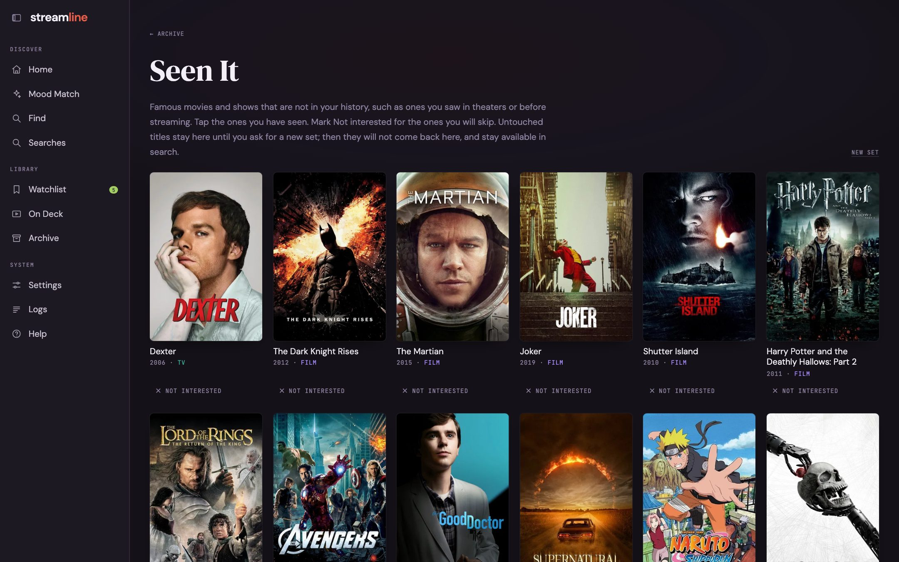

## Archive

The **Archive** is everything you've watched, from every source.

Switch between poster, list, and compact views.
Filter by type, source, and rating; sort A to Z, Z to A, or by most recently watched.
**Recently watched** uses real watch dates only, so titles with no date sort last.

Click a poster for its title page: overview, credits, AI analysis, your rating, and links to TMDB and IMDb.
**Add watched** adds a title by hand. If the name matches more than one title, you pick the right one.

## Seen It

Exports miss things you watched years ago or somewhere else.
**Seen It** shows sets of famous movies and shows to tap through: **Seen it** adds a title to your archive, **Not interested** keeps it out of recommendations.

## Rate It

The taste profile is built from titles you mark **Loved**.
**Rate It** shows your unrated archive in sets: tap the ones you loved, mark **Not for me** only for real no's, and leave the rest for a later round.

Followed shows count as loved.
Kids and family titles are hidden by default, behind a switch, and you can rate one source at a time.

Ratings use the same three answers everywhere in the app:

| Answer | Also called | Effect |
|---|---|---|
| Loved | More like this | Shapes the taste rows and lifts similar titles |
| Fine | It was fine | Records that you've answered; changes nothing |
| Not for me | Less like this | Lowers similar titles and notes what to avoid |

New ratings count in searches straight away.
The taste rows on the home page change only after `./recommend setup --refresh-profile`.

## How the taste rows are built

Each loved title gets a few taste tags, written once by the reasoning model and saved.
The tags are grouped into 10 to 16 themes, and code places each title in the best-matching theme.
Because those answers are saved, rebuilding with the same ratings gives the same rows in the same order and makes no LLM calls.
