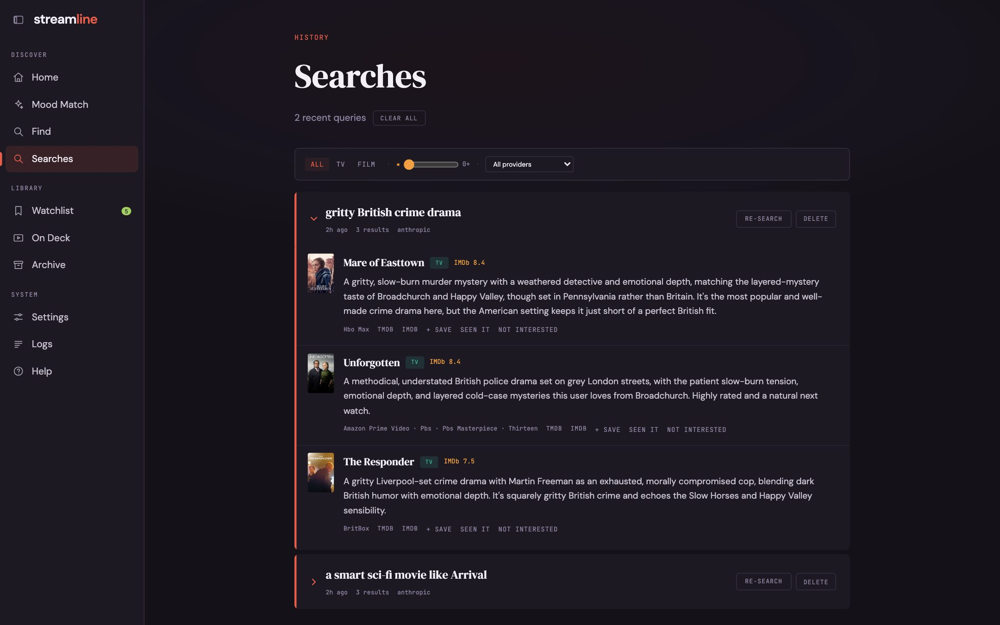

Type what you want into the search box on the home page, or pass it to `./recommend`.

## What you can ask

- **Genre and mood**: "gritty British crime drama", "feel-good Bollywood comedy"
- **Similar to**: "spy thriller like Slow Horses", "something like Fleabag but darker"
- **Runtime and count**: "give me 5 underrated sci-fi movies", "90-minute thriller"
- **Language or region**: "Hindi crime thriller", "Korean romance", "French arthouse"
- **Platform**: "what's good on Netflix right now", "Apple TV+ sci-fi"

Two special questions:

- **Why not?** "why not Slow Horses?" explains why a title was left out or never came up.
- **Should I keep going?** "I started Severance and stopped. Should I keep going?" checks how much you watched and gives an opinion.

## How a search works

1. The reasoning model turns your words into a structured request: genres, moods, languages, similar titles, platforms, and type.
2. Candidates come from two places at once: TMDB Discover filters and the model's own suggestions.
3. Anything you've watched, saved, or marked Not interested is removed, and so is anything shown in your last 20 searches.
4. Each candidate is checked for streaming availability in your region.
5. The reasoning model ranks what is left. How well a title fits the request comes first; your taste profile breaks ties.

Every search also includes your current ratings, so a new **More like this** or **Less like this** counts straight away, without a rebuild.
The same goes for the **Not for me** note in [Settings](/guides/settings/).

## Results

Each result shows its rating (IMDb, or TMDB when IMDb has none), why it fits your taste, and where it streams.
From any result you can:

- **Save** it to the watchlist
- Mark it **Seen it**, which adds it to your archive
- Mark it **Not interested**, which keeps it out of future results

## Follow-ups in the terminal

Run `./recommend` with no query for an interactive session that remembers the last answer:

- "what else?" runs the last request again without repeating results
- "more like #2" uses the second result as the new starting point
- "but something British", "something lighter", "make it a movie" adjust the last request
