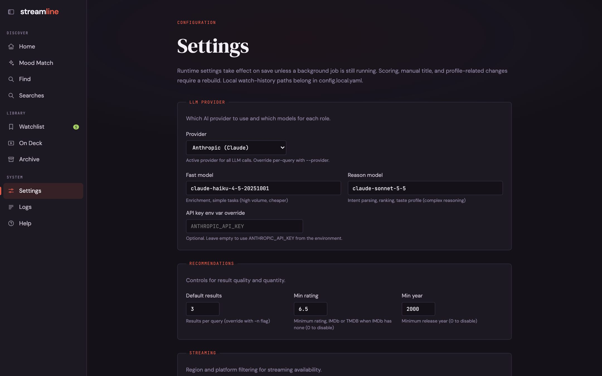

## Settings

The **Settings** page edits `config.yaml` from the browser: provider and models, result count, minimum rating and year, region and platforms, timeouts, and scoring.

Most settings take effect when you save.
Scoring and profile-related changes need a profile rebuild, and the app tells you when one is due.
Watch-history paths belong in `config.local.yaml`, not here.
API keys are never shown or stored here; only the name of the environment variable is.

## Logs and status

- **Logs** shows the app log in the browser.
- `/status` returns JSON with the provider, models, cache counts, when the profile was built, when IMDb ratings were refreshed, and any running background jobs.
- `/healthz` returns `ok`, `busy`, or `not ready`, for monitoring.

## Password

Set `STREAMLINE_PASSWORD` to put the whole web UI behind a browser password prompt.
`/healthz` and the Plex webhook stay open; see [Running as a service](/guides/running-as-a-service/).
