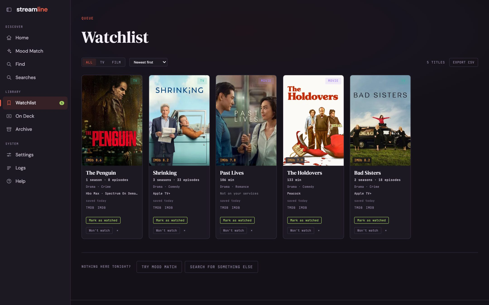

## Watchlist

**Save** a title from any page and it goes to the **Watchlist**.

Each card shows the rating, genres, where it streams, and links to TMDB and IMDb.
**Mark as watched** moves a title to your archive; **Won't watch** removes it and keeps it out of recommendations.
**Export CSV** downloads the list.

## Searches

**Searches** keeps your recent searches and Mood Match runs with their results, so you can come back to them.
Expand one to see its results and act on them, **Re-search** to run it again, or **Delete** it.
Deleted searches still count toward "don't show me this again".
